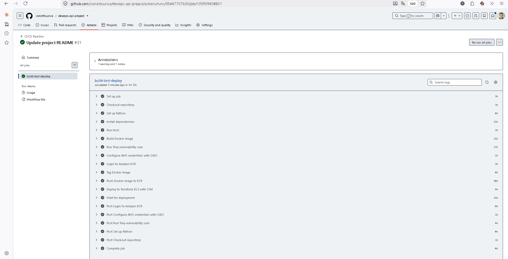
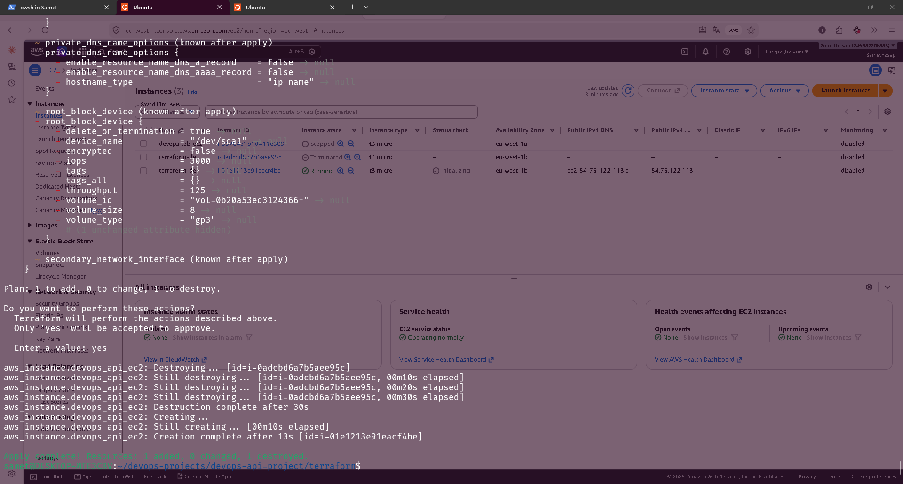
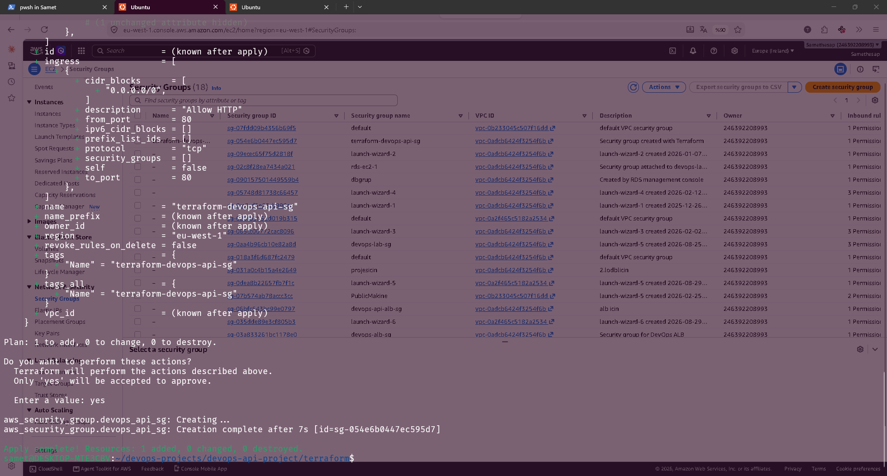
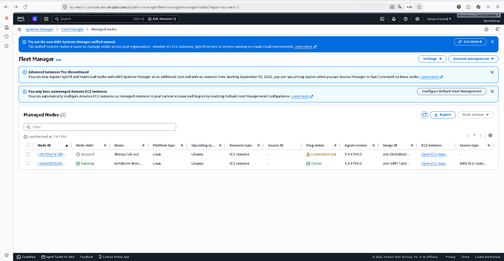
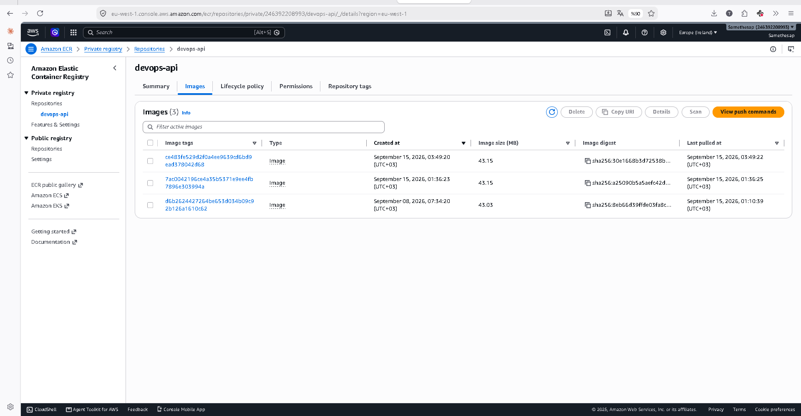
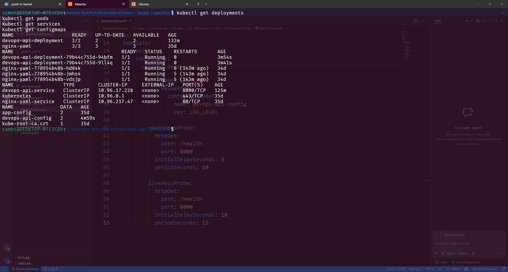
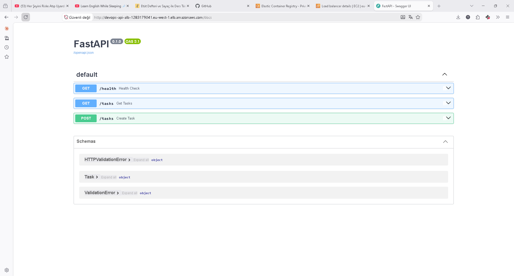
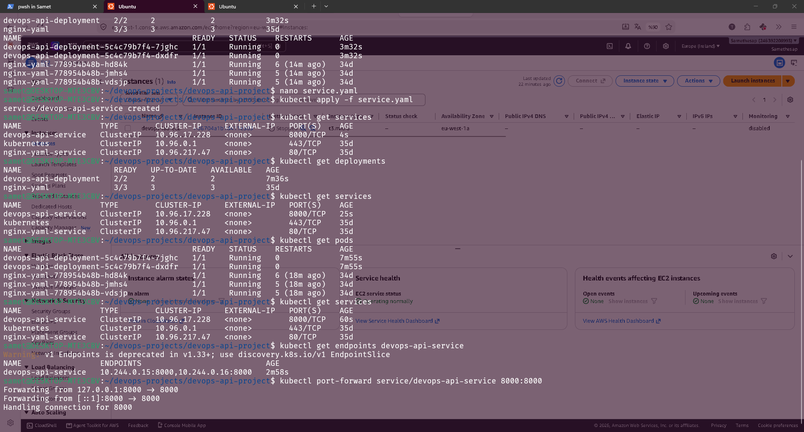

# End-to-End DevOps API Project

This project demonstrates an end-to-end DevOps workflow using:

- Python
- FastAPI
- Docker
- GitHub Actions
- Trivy
- AWS ECR
- AWS EC2
- AWS Systems Manager
- AWS IAM
- Terraform
- Kubernetes

The main goal of this project was to build a complete CI/CD and Infrastructure as Code workflow and understand how each component works together.

---

## Project Architecture

    Developer
       |
       | git push
       v
    GitHub Repository
       |
       v
    GitHub Actions
       |
       +--> Pytest
       |
       +--> Docker Build
       |
       +--> Trivy Security Scan
       |
       +--> AWS Authentication with OIDC
       |
       v
    Amazon ECR
       |
       v
    AWS Systems Manager
       |
       v
    Terraform-managed EC2
       |
       v
    Docker Container
       |
       v
    FastAPI Application

---

## CI/CD Pipeline

Every push to the `main` branch triggers the GitHub Actions workflow.

The pipeline performs the following steps:

1. Checkout repository
2. Configure Python
3. Install dependencies
4. Run Pytest
5. Build Docker image
6. Scan Docker image with Trivy
7. Authenticate to AWS using GitHub OIDC
8. Login to Amazon ECR
9. Push Docker image to ECR
10. Send deployment command to EC2 using AWS Systems Manager
11. Pull the new Docker image on EC2
12. Stop and remove the previous container
13. Start the new container

Docker images are tagged using:

    Git Commit SHA + GitHub Run Attempt

Example:

    493c97941a810e61706d04a70bbb2f3f39576c33-1

This provides traceability and avoids conflicts with immutable ECR tags.

---

## Infrastructure as Code with Terraform

AWS infrastructure is managed using Terraform.

Terraform provisions and configures:

- EC2 instance
- Security Group
- IAM Role
- IAM Instance Profile
- SSM permissions
- ECR read permissions
- EC2 bootstrap configuration with `user_data`

The EC2 instance automatically installs:

- Docker
- AWS CLI
- AWS Systems Manager Agent

This means a newly created EC2 instance becomes deployment-ready automatically.

---

## AWS IAM and OIDC

GitHub Actions authenticates to AWS using OpenID Connect.

No permanent AWS access keys are stored in GitHub.

Two separate IAM roles are used.

### GitHub Actions IAM Role

Used by GitHub Actions.

Responsibilities:

- Authenticate to Amazon ECR
- Push Docker images
- Send deployment commands with SSM
- Read SSM command results

### EC2 IAM Role

Attached to the EC2 instance using an Instance Profile.

Responsibilities:

- Connect to AWS Systems Manager
- Pull Docker images from Amazon ECR

---

## Security

Security practices used in the project:

- GitHub OIDC instead of permanent AWS credentials
- IAM role-based permissions
- Separate IAM roles for GitHub Actions and EC2
- Trivy container vulnerability scanning
- Immutable ECR image tags
- AWS Systems Manager instead of SSH
- No SSH port required for EC2 administration
- Terraform state files excluded from Git
- `.terraform` directory excluded from Git

---

## Kubernetes

The application was also deployed locally using Kubernetes.

Implemented Kubernetes concepts:

- Deployment
- Multiple replicas
- ClusterIP Service
- Readiness Probe
- Liveness Probe
- ConfigMap
- Rolling Update
- Rollback
- Pod self-healing

Example:

    Service
       |
       v
    Deployment
       |
       +---- Pod
       |
       +---- Pod

Kubernetes automatically replaces failed Pods to maintain the desired replica count.

---

## Health Check

The FastAPI application provides:

    GET /health

Expected response:

    {
      "status": "healthy"
    }

The health endpoint is used to verify whether the application is running correctly.

---

## Troubleshooting Experience

During the project, several real-world DevOps problems were encountered and solved.

Examples:

- Missing Terraform IAM permissions
- IAM Role and Instance Profile configuration
- SSM Agent registration problems
- Missing AWS CLI on EC2
- GitHub Actions Python import path problem
- Trivy vulnerability findings
- Terraform provider files accidentally committed to Git
- Terraform state files accidentally added to Git
- ECR immutable tag conflict
- EC2 instance ID changing after Terraform replacement
- Missing ECR permissions for GitHub Actions
- Missing SSM permissions for GitHub Actions
- Docker permissions in Session Manager

These problems helped improve troubleshooting skills across AWS, Docker, CI/CD, Terraform and Kubernetes.

---

## Final Deployment Flow

    git push
       |
       v
    GitHub Actions
       |
       v
    Pytest
       |
       v
    Docker Build
       |
       v
    Trivy Scan
       |
       v
    GitHub OIDC
       |
       v
    Amazon ECR
       |
       v
    AWS Systems Manager
       |
       v
    Terraform EC2
       |
       v
    Docker Pull
       |
       v
    Docker Run
       |
       v
    FastAPI

---

## Final Verification

The deployed Docker container can be verified with:

    sudo docker ps

Application health can be verified with:

    curl http://localhost:8000/health

Expected result:

    {"status":"healthy"}

---

## Technologies Used

- Python
- FastAPI
- Pytest
- Docker
- Kubernetes
- Terraform
- GitHub Actions
- Trivy
- AWS EC2
- Amazon ECR
- AWS IAM
- AWS Systems Manager
- GitHub OIDC

# Türkçe Açıklama

Bu proje; Python, FastAPI, Docker, GitHub Actions, Trivy, AWS ECR, AWS EC2, AWS Systems Manager, AWS IAM, Terraform ve Kubernetes kullanılarak hazırlanmış uçtan uca bir DevOps projesidir.

Projenin temel amacı, CI/CD, Infrastructure as Code (IaC), container yönetimi, güvenlik taraması ve AWS üzerinde otomatik deployment süreçlerinin nasıl birlikte çalıştığını uygulamalı olarak öğrenmek ve göstermekti.

---

## Proje Mimarisi

    Geliştirici
       |
       | git push
       v
    GitHub Repository
       |
       v
    GitHub Actions
       |
       +--> Pytest
       |
       +--> Docker Build
       |
       +--> Trivy Güvenlik Taraması
       |
       +--> OIDC ile AWS Kimlik Doğrulama
       |
       v
    Amazon ECR
       |
       v
    AWS Systems Manager
       |
       v
    Terraform ile Yönetilen EC2
       |
       v
    Docker Container
       |
       v
    FastAPI Uygulaması

---

## CI/CD Pipeline

`main` branch'ine yapılan her push işlemi GitHub Actions pipeline'ını otomatik olarak tetikler.

Pipeline sırasıyla şu işlemleri gerçekleştirir:

1. Repository'yi checkout eder
2. Python ortamını hazırlar
3. Bağımlılıkları kurar
4. Pytest testlerini çalıştırır
5. Docker image oluşturur
6. Docker image'ı Trivy ile güvenlik taramasından geçirir
7. GitHub OIDC kullanarak AWS üzerinde kimlik doğrulaması yapar
8. Amazon ECR'a giriş yapar
9. Docker image'ı ECR'a push eder
10. AWS Systems Manager üzerinden EC2'ye deployment komutu gönderir
11. EC2 yeni Docker image'ını ECR'dan çeker
12. Eski container'ı durdurur ve siler
13. Yeni container'ı çalıştırır

Docker image'ları şu formatta tag'lenir:

    Git Commit SHA + GitHub Run Attempt

Örnek:

    493c97941a810e61706d04a70bbb2f3f39576c33-1

Bu yapı, deployment'ların hangi commit'ten geldiğini takip etmeyi kolaylaştırır ve immutable ECR tag yapısıyla uyumludur.

---

## Terraform ile Infrastructure as Code

AWS altyapısı Terraform kullanılarak yönetilmektedir.

Terraform ile oluşturulan ve yönetilen kaynaklar:

- EC2 instance
- Security Group
- IAM Role
- IAM Instance Profile
- SSM yetkileri
- ECR ReadOnly yetkileri
- `user_data` ile EC2 başlangıç yapılandırması

EC2 instance oluşturulduğunda aşağıdaki araçlar otomatik olarak kurulur:

- Docker
- AWS CLI
- AWS Systems Manager Agent

Bu sayede yeni bir EC2 makinesi oluşturulduğunda manuel kurulum yapmadan deployment için hazır hale gelir.

---

## AWS IAM ve OIDC

GitHub Actions, AWS üzerinde kimlik doğrulaması yapmak için OpenID Connect (OIDC) kullanır.

GitHub üzerinde kalıcı AWS Access Key ve Secret Key tutulmaz.

Projede iki farklı IAM Role kullanılır.

### GitHub Actions IAM Role

GitHub Actions tarafından kullanılır.

Görevleri:

- Amazon ECR'a bağlanmak
- Docker image push etmek
- AWS Systems Manager üzerinden EC2'ye deployment komutu göndermek
- SSM komut sonuçlarını okumak

### EC2 IAM Role

Instance Profile üzerinden EC2 instance'a bağlanır.

Görevleri:

- AWS Systems Manager'a bağlanmak
- Amazon ECR'dan Docker image çekmek

---

## Güvenlik

Projede kullanılan bazı güvenlik uygulamaları:

- Kalıcı AWS credential yerine GitHub OIDC kullanımı
- IAM Role tabanlı yetkilendirme
- GitHub Actions ve EC2 için ayrı IAM Role kullanımı
- Trivy ile container güvenlik taraması
- Immutable ECR image tag kullanımı
- SSH yerine AWS Systems Manager kullanımı
- EC2 yönetimi için SSH portunun açılmaması
- Terraform state dosyalarının Git'e eklenmemesi
- `.terraform` klasörünün Git dışında tutulması

---

## Kubernetes

Uygulama ayrıca local Kubernetes ortamında deploy edilmiştir.

Uygulanan Kubernetes konuları:

- Deployment
- Birden fazla replica
- ClusterIP Service
- Readiness Probe
- Liveness Probe
- ConfigMap
- Rolling Update
- Rollback
- Pod self-healing

Örnek yapı:

    Service
       |
       v
    Deployment
       |
       +---- Pod
       |
       +---- Pod

Kubernetes, silinen veya hata alan Pod'ları otomatik olarak yeniden oluşturarak istenilen replica sayısını korur.

---

## Health Check

FastAPI uygulamasında aşağıdaki health endpoint bulunmaktadır:

    GET /health

Beklenen cevap:

    {
      "status": "healthy"
    }

Bu endpoint uygulamanın sağlıklı şekilde çalışıp çalışmadığını kontrol etmek için kullanılmaktadır.

---

## Troubleshooting Deneyimi

Proje sırasında birçok gerçek DevOps problemiyle karşılaşıldı ve çözüldü.

Örnekler:

- Terraform IAM permission eksiklikleri
- IAM Role ve Instance Profile bağlantısı
- SSM Agent'ın Fleet Manager'a kayıt olmaması
- EC2 üzerinde AWS CLI eksikliği
- GitHub Actions Python import path problemi
- Trivy tarafından tespit edilen güvenlik açıkları
- Terraform provider dosyalarının yanlışlıkla Git'e eklenmesi
- Terraform state dosyalarının Git'e eklenmesi
- Immutable ECR tag çakışması
- Terraform replacement sonrası değişen EC2 Instance ID
- GitHub Actions için eksik ECR yetkileri
- GitHub Actions için eksik SSM yetkileri
- Session Manager içinde Docker permission problemi

Bu hataların çözülmesi AWS, Docker, CI/CD, Terraform ve Kubernetes tarafında gerçek troubleshooting deneyimi kazandırdı.

---

## Final Deployment Akışı

    git push
       |
       v
    GitHub Actions
       |
       v
    Pytest
       |
       v
    Docker Build
       |
       v
    Trivy Scan
       |
       v
    GitHub OIDC
       |
       v
    Amazon ECR
       |
       v
    AWS Systems Manager
       |
       v
    Terraform EC2
       |
       v
    Docker Pull
       |
       v
    Docker Run
       |
       v
    FastAPI

---

## Final Doğrulama

Çalışan Docker container şu komutla kontrol edilebilir:

    sudo docker ps

Uygulamanın health endpoint'i şu komutla kontrol edilebilir:

    curl http://localhost:8000/health

Beklenen sonuç:

    {"status":"healthy"}

---

## Kullanılan Teknolojiler

- Python
- FastAPI
- Pytest
- Docker
- Kubernetes
- Terraform
- GitHub Actions
- Trivy
- AWS EC2
- Amazon ECR
- AWS IAM
- AWS Systems Manager
- GitHub OIDC

## Screenshots

### CI/CD Pipeline

### Terraform EC2 Deployment

### Terraform Security Group

### AWS Systems Manager

### Amazon ECR

### Kubernetes

### Application Access via ALB

### Final Deployment Verification
